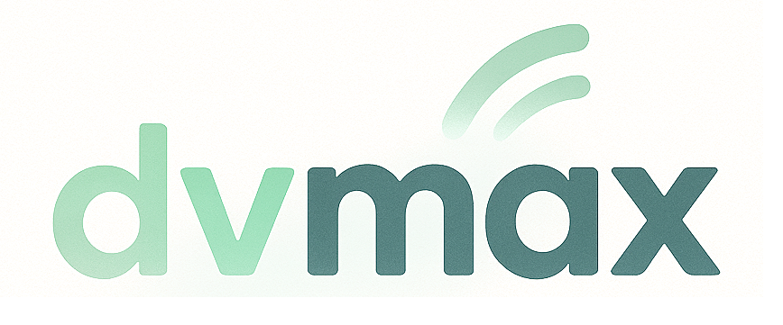

<p align="center">
  
</p>

# Global Dividend ML Engine – Full Strategy Guide

This document serves as the **complete reference** for designing, storing, and operating the data pipeline and ML system for your global dividend stock selection model. It combines both:

- End-to-end ML strategy and modeling pipeline
- Practical data management plan for refresh, storage, and usage

---

## ✅ Project Goal

Build a machine learning engine that selects a basket of **non-U.S. dividend-paying stocks** with:

- **High net dividend yield**
- **Low risk of dividend cuts**
- **Stable financial and price profiles**
- **Minimal U.S. estate tax exposure**

---

## ✅ Core Principles

- Predict **probability of dividend cut within 12 months** (classification)
- Invest only in stocks with **low cut risk + attractive adjusted yield**
- Focus on **non-U.S. stocks**, via **direct holdings** or **UCITS ETFs**
- Emphasize **stability**, **explainability**, and **practical trading constraints**

---

## ✅ End-to-End Pipeline

### Phase 1: Planning and Data Collection

1. Define portfolio scope: 10–30 ex-U.S. stocks, quarterly rebalancing, low turnover.
2. Main data source: **Financial Modeling Prep (FMP)** (fundamentals, dividends, price history).
3. Others: Yahoo Finance (optional), Alpha Vantage (optional), macro (OECD, World Bank).
4. Store all structured data as **Parquet**.

---

### Phase 2: Feature Engineering

Use rolling and summary features (not raw time series):
- **Dividend**: yield, growth, payout ratios, streaks
- **Financial**: EPS/FCF growth, debt ratios, ROE, margin
- **Price-based**: 6M/12M return, drawdown, volatility, moving averages
- **Contextual**: sector encoding, currency risk, macro tags

---

### Phase 3: ML Modeling

- Model: **XGBoost Classifier**
- Target: Dividend cut in next 12M (binary)
- Cross-validation: walk-forward style
- Avoid lookahead bias by shifting features to match publication lag
- Output: **cut probability**, used for filtering and scoring

---

### Phase 4: Scoring and Optimization

- Score filtered safe stocks using:
  ```
  Final Score = (AdjYield × 0.5) + (DivGrowth × 0.3) + (Stability × 0.2)
  ```
- Rank and select top 10–30 stocks

---

### Phase 5: Portfolio Construction & Rebalancing

- Style: Equal-weight or weighted by score
- Constraints:
  - Max 20% per sector/country
  - Min 5 sectors/countries
- Stability logic:
  - Only replace stocks with significant score/risk gap
  - Apply minimum holding period (e.g., 2–3 quarters)
  - Avoid short-term price-driven churn

---

### Phase 6: Monitoring and Reporting

- Portfolio-level metrics:
  - Estimated vs realized yield
  - Stability score
  - Red flags: score drop, price crash, risk spike
- Report annually:
  - Total return, net yield, turnover rate, dividend cuts avoided

---

### Phase 7: App Output

- Scored stock list
- Estimated vs realized dividend yield (12M)
- Stability markers (drawdowns, risk change)
- Score attribution per stock (explainable AI)

---

## ✅ Data Management Strategy

### Why Weekly Price Data?

Even if you rebalance quarterly:
- Weekly prices are needed to calculate accurate **6M/12M returns**, drawdown, volatility
- Gaps in updates weaken rolling feature reliability

---

### Data Refresh Schedule

| Data Type        | Frequency  | Notes |
|------------------|------------|-------|
| Prices           | Weekly     | To compute rolling returns/features |
| Fundamentals     | Quarterly  | Sync with earnings release |
| Dividends        | Quarterly  | Use latest declared |
| Macro (optional) | Quarterly  | Lagged sources (OECD, World Bank) |

---

### File Storage: Parquet

Efficient, compressed, columnar format:

```
/data
  /prices/
    prices_raw.parquet
    prices_weekly_agg.parquet
  /fundamentals/
    fundamentals_q.parquet
  /dividends/
    dividend_history_q.parquet
  /macro/
    interest_rates.parquet
  /features/
    stock_features_YYYYQX.parquet
```

---

### Storage Locations

| Option         | Use Case                          |
|----------------|------------------------------------|
| Local disk     | Solo development                  |
| Cloud (S3, GCS)| Team use, deployment              |
| DuckDB         | SQL access to Parquet on disk     |

---

### Tools

- Pandas or Polars for pipelines
- DuckDB for hybrid SQL workflows
- pyarrow for Parquet IO

---

### Action Checklist

- [ ] Setup `/data/` structure in repo
- [ ] Weekly job to fetch and store raw prices
- [ ] Quarterly job to refresh fundamentals, dividends, macro
- [ ] All derived features stored in `/data/features/` as `.parquet`
- [ ] Use rolling windows to generate features weekly
- [ ] Document schema and logic in `/docs/` or notebooks

---

# Global Dividend ML Engine – Full Tech Stack (Explained)

A practical, layered overview of all technologies used (or considered) in the system — from modeling to deployment.

---

## 1. 🔬 Modeling & Optimization Layer

| Tool                             | Purpose                                                | Status     | Explanation |
|----------------------------------|--------------------------------------------------------|------------|-------------|
| **XGBoost**                      | Binary classifier for dividend cut prediction          | ✅ Core     | Reliable, interpretable, works well with tabular financial data |
| **Polars**                       | Fast dataframe engine for feature pipelines            | ✅ Core     | Efficient handling of time series, much faster than Pandas |
| **PyArrow**                      | Parquet file access, efficient column I/O              | ✅ Core     | Works with Polars for feature storage and retrieval |
| **Numpy / Scikit-learn**         | Scoring logic, normalization, helper metrics           | ✅ Core     | Useful for basic model evaluation and math ops |
| **Quantum-Inspired Optimizers**  | Advanced portfolio selection with constraints          | ⏳ Optional | Solve QUBO problems: maximize yield + minimize risk under constraints like sector caps and turnover limits |
| **Backtesting Logic**           | Evaluate portfolio performance over time               | ✅ Core     | Custom logic to simulate rebalancing and income vs. drawdowns |

---

## 2. 💾 Data Management & Sources

| Component               | Purpose                                  | Status     | Explanation |
|--------------------------|-------------------------------------------|------------|-------------|
| **FMP API**              | Fundamentals, prices, dividends (main feed) | ✅ Core     | Used for global coverage including non-U.S. dividend history |
| **Parquet Files**        | Format for storing time series + features | ✅ Core     | Efficient, compatible with Polars, perfect for offline ML |
| **DuckDB** (optional)    | SQL interface on top of Parquet files     | ❌ Skippable| Use only if you prefer SQL over Polars for queries |
| **OECD / World Bank**    | Optional macro features (GDP, rates)      | ⏳ Optional | May be useful for regime-aware modeling |
| **Kafka** (optional)     | Live updates & event-triggered pipelines  | ❌ Skippable| Consider only if you build a real-time alert system later |

---

## 3. 🛠️ Development & Infrastructure

| Tool                | Purpose                                  | Status     | Explanation |
|----------------------|-------------------------------------------|------------|-------------|
| **Docker**           | Reproducible dev and deployment           | ✅ Core     | Avoids “it works on my machine” problems; enables CI containers |
| **GitHub + GitHub Actions** | Version control, CI/CD, automation     | ✅ Core     | Automates model updates, tests, documentation builds |
| **Cursor** (optional) | AI-native coding IDE                     | ⏳ Optional | Boosts iteration speed via assisted dev, refactoring |
| **Notebooks + Markdown** | Prototypes and documentation           | ✅ Core     | Use for feature trials, visualizations, and tracking logic |

---

## 4. ⚙️ App Interface & Serving

| Tool                  | Purpose                                      | Status     | Explanation |
|------------------------|---------------------------------------------|------------|-------------|
| **Streamlit**          | Dashboard to explore stock scores and outputs| ⏳ Optional | Great for early-stage internal visualization |
| **FastAPI / Flask**    | Serve score inference via REST API          | ⏳ Optional | Required only if exposing the model as a service |
| **BASE44**             | No-code AI builder to create internal tools | ⏳ Optional | Can be used to develop dashboards or monitor apps without frontend dev |
| **Lovable**            | Natural-language → full-stack app generation| ⏳ Optional | Helps build UI with Supabase/Firebase backends via AI prompts |
| **Supabase / Firebase**| Realtime database and auth backend          | ❌ Skippable| Use only if you need stateful apps or user accounts later |

---

## 5. ☁️ Storage & Hosting

| Tool                 | Purpose                                     | Free Tier? | Use Now? | Notes |
|----------------------|---------------------------------------------|------------|----------|-------|
| **Local Disk**       | Store raw and processed data during dev     | Yes        | ✅        | Use `/data/` layout with Parquet |
| **AWS S3**           | Cloud storage for models and outputs        | 5GB        | ⏳        | Standard, reliable, widely supported |
| **Google Cloud Storage** | Same as above, GCP option              | 5GB        | ⏳        | Useful if using Colab or Vertex later |
| **Cloudflare R2**    | S3-compatible with no egress fees           | Yes        | ⏳        | Ideal for production model/data hosting |
| **Backblaze B2**     | Cheap and S3-compatible                     | Yes        | ⏳        | Cost-efficient option for static archive storage |

---

## ✅ Suggested Development Phases

### Phase 1 — Core Engine (Start Now)
- [x] Fetch data from FMP and store in Parquet
- [x] Build Polars-based feature pipeline
- [x] Train XGBoost and evaluate cut-risk predictions
- [x] Backtest portfolios using yield + score logic

### Phase 2 — Infrastructure
- [x] Set up Docker + GitHub Actions
- [ ] Schedule retraining and scoring jobs
- [ ] Document model output logic in markdown

### Phase 3 — Optimization & App
- [ ] Integrate QUBO-based optimizer (Toshiba or D-Wave)
- [ ] Create Streamlit dashboard or FastAPI endpoint
- [ ] Optionally try BASE44/Lovable to prototype UI faster

### Phase 4 — Hosting
- [ ] Move to cloud storage (R2 or S3)
- [ ] Optional: deploy inference or dashboard

---

Let this guide serve as your living blueprint for turning the ML model into a production-ready portfolio engine.

---


*Last updated: 2025-05-11*
